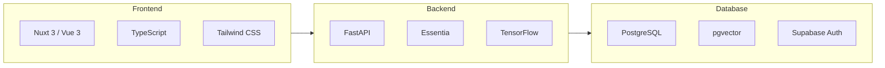
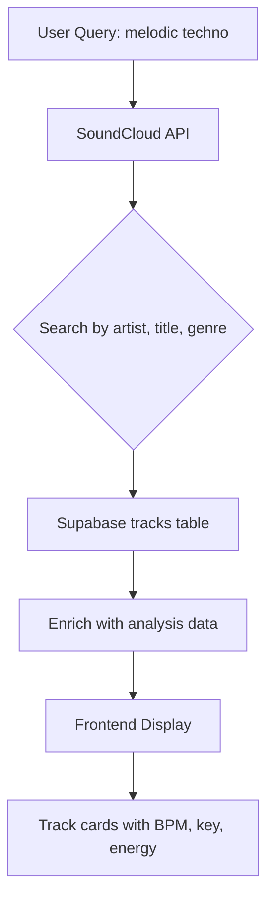
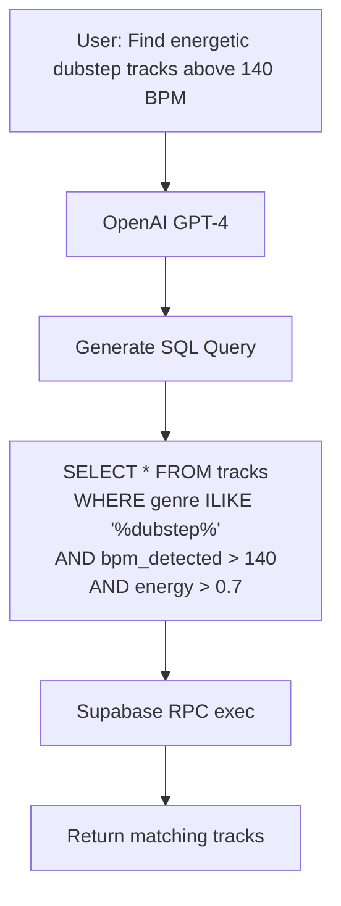
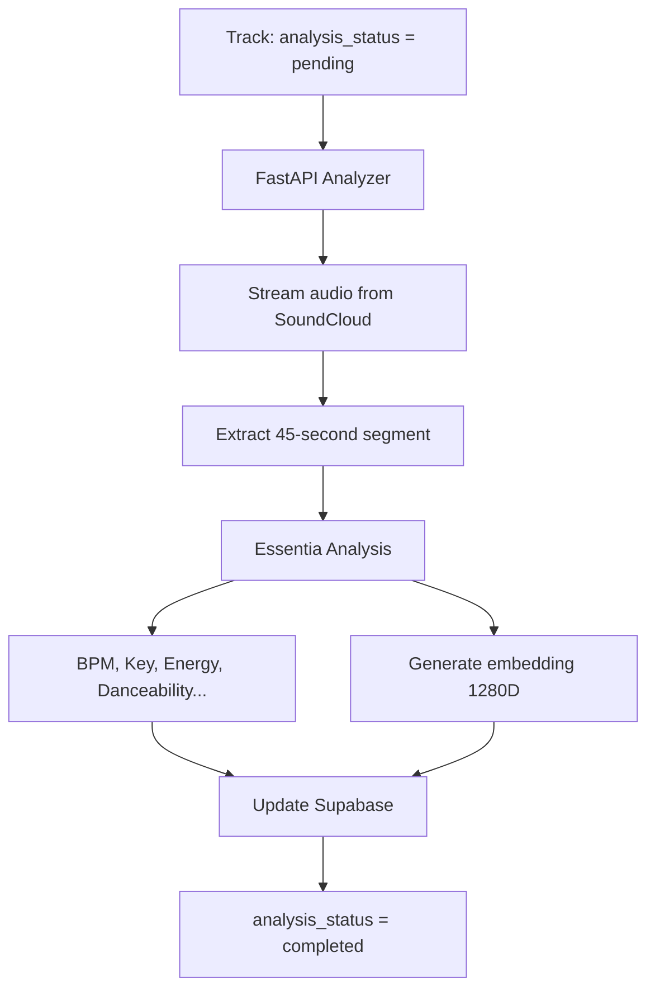
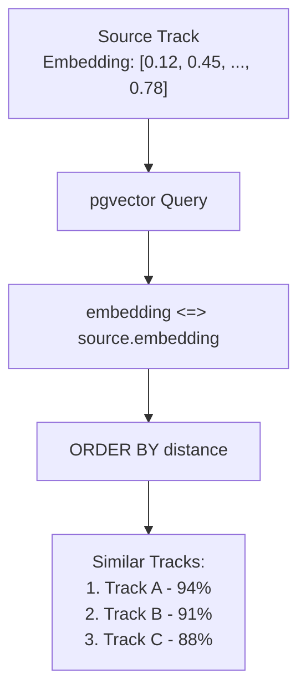
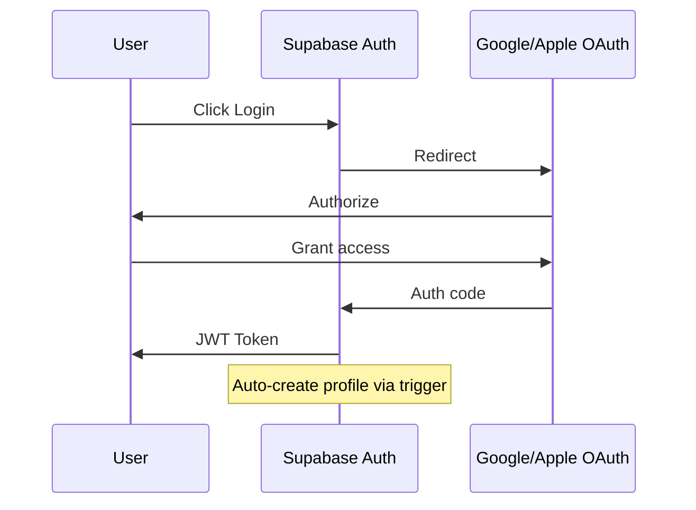

# Musaic - Features & Architecture

## Overview

Musaic is a music discovery platform that searches SoundCloud, analyzes audio tracks, and provides intelligent search capabilities.

---

## Core Features

### 1. Track Search

Search tracks from SoundCloud with real-time results.

### 2. AI Search

Natural language search powered by GPT-4 that generates SQL queries.

### 3. Audio Analysis

Deep audio analysis using Essentia TensorFlow models.

**Analysis Fields:**

| Category | Fields |
|----------|--------|
| Rhythm | `bpm_detected`, `bpm_confidence` |
| Tonal | `key_detected`, `key_confidence` |
| Dynamics | `energy`, `loudness`, `dynamic_complexity` |
| Timbre | `spectral_centroid`, `dissonance` |
| High-level | `danceability`, `speechiness`, `instrumentalness`, `acousticness`, `valence`, `liveness` |

### 4. Similar Tracks (Vector Search)

Find acoustically similar tracks using pgvector cosine similarity.

**How it works:**

1. Each analyzed track has a 1280-dimensional embedding vector
2. Embeddings capture acoustic features (rhythm, timbre, mood)
3. Cosine distance (`<=>`) measures similarity between vectors
4. Lower distance = more similar tracks

---

## Database Schema

### tracks table

| Column | Type | Description |
|--------|------|-------------|
| `soundcloud_id` | BIGINT (PK) | SoundCloud unique ID |
| `urn` | TEXT | SoundCloud URN |
| `permalink_url` | TEXT | Full URL |
| `title` | TEXT | Track title |
| `artist` | TEXT | Artist name |
| `artwork` | TEXT | Artwork URL |
| `duration` | INTEGER | Duration in ms |
| `genre` | TEXT | Genre tag |
| `tags` | TEXT[] | Array of tags |
| **Audio Analysis** | | |
| `bpm_detected` | REAL | BPM (60-200) |
| `key_detected` | TEXT | Musical key (e.g. "A minor") |
| `energy` | REAL | Energy level (0-1) |
| `danceability` | REAL | Danceability (0-1) |
| `valence` | REAL | Mood positivity (0-1) |
| `embedding` | VECTOR(1280) | Audio feature vector |
| `analysis_status` | TEXT | pending/processing/completed |
| **Download Info** | | |
| `download_status` | TEXT | FreeDirectLink/FreeExternalLink/No |
| `downloadable` | BOOLEAN | Direct download available |
| `purchase_url` | TEXT | Buy/download link |

### profiles table

| Column | Type | Description |
|--------|------|-------------|
| `id` | UUID (PK) | User ID (from auth.users) |
| `is_premium` | BOOLEAN | Premium subscription |
| `is_admin` | BOOLEAN | Admin access |
| `premium_until` | TIMESTAMPTZ | Subscription expiry |

---

## API Endpoints

### Search
| Method | Endpoint | Description |
|--------|----------|-------------|
| GET | `/api/search` | Search SoundCloud tracks |
| POST | `/api/aiQuery` | AI-powered natural language search |

### Tracks
| Method | Endpoint | Description |
|--------|----------|-------------|
| GET | `/api/similar/:id` | Find similar tracks |
| GET | `/api/stream/:id` | Stream audio |
| GET | `/api/download/:id` | Download track |

### Analysis
| Method | Endpoint | Description |
|--------|----------|-------------|
| POST | `/analyze` | Analyze single track |
| POST | `/analyze/batch` | Batch analyze tracks |

### Dashboard
| Method | Endpoint | Description |
|--------|----------|-------------|
| GET | `/api/dashboard/stats` | Get analytics |

---

## Authentication

---

## Premium Features

| Feature | Free | Premium |
|---------|------|---------|
| Track search | ✅ | ✅ |
| Audio streaming | ✅ | ✅ |
| Free downloads | ✅ | ✅ |
| AI search | 5/day | Unlimited |
| Similar tracks | ✅ | ✅ |
| Ads | Yes | No |

---

## Tech Stack

### Frontend
- **Framework**: Nuxt 3 (Vue 3)
- **Language**: TypeScript
- **Styling**: Tailwind CSS v4
- **UI Components**: Nuxt UI
- **State**: Composables (Vue Composition API)

### Backend
- **API**: FastAPI (Python)
- **Audio Analysis**: Essentia + TensorFlow
- **Audio Extraction**: yt-dlp

### Database
- **Platform**: Supabase
- **Database**: PostgreSQL
- **Vector Search**: pgvector extension
- **Auth**: Supabase Auth (OAuth)

### Infrastructure
- **CI/CD**: GitHub Actions
- **Containerization**: Docker
